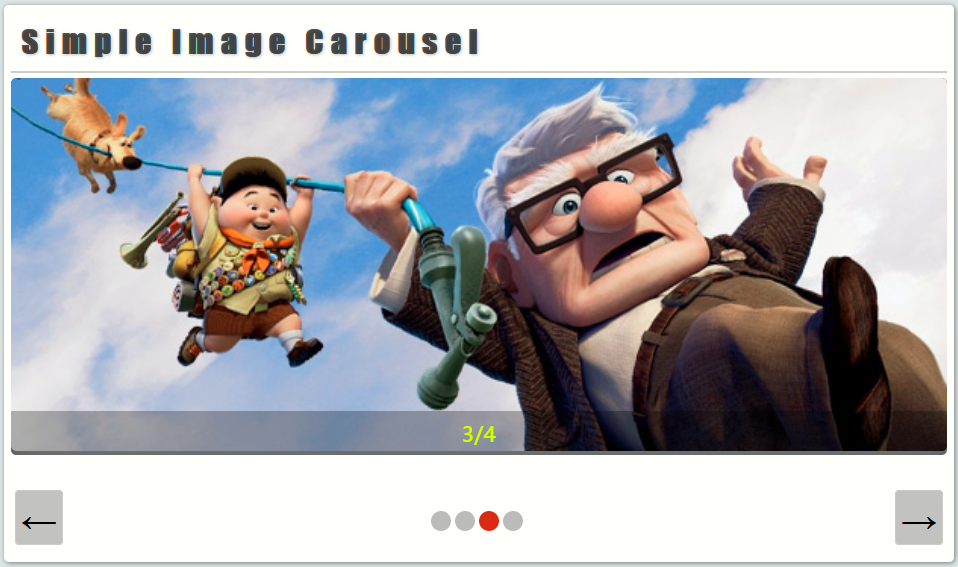

# Codeparl image carousel

## screenshot

## About this code

This code example shows how to write a simple image carousel in vanillajs.
An image carousel is a collection of hidden images in a div element which are shown one at a time by sliding in the current image and stays for some seconds until the next image slides in.

## How to run the code

To run this code example, simply download the code and open the folder and find `index.html` and open it with your web browser.

## Author

This code example was writted by [Codeparl](https://github.com/codeparl)

## More code examples

For more code examples, please checkout [codeparl.com](https://codeparl.com)

## License

Licensed under MIT (https://github.com/codeparl/Codeparl-image-carousel/blob/master/LICENSE).